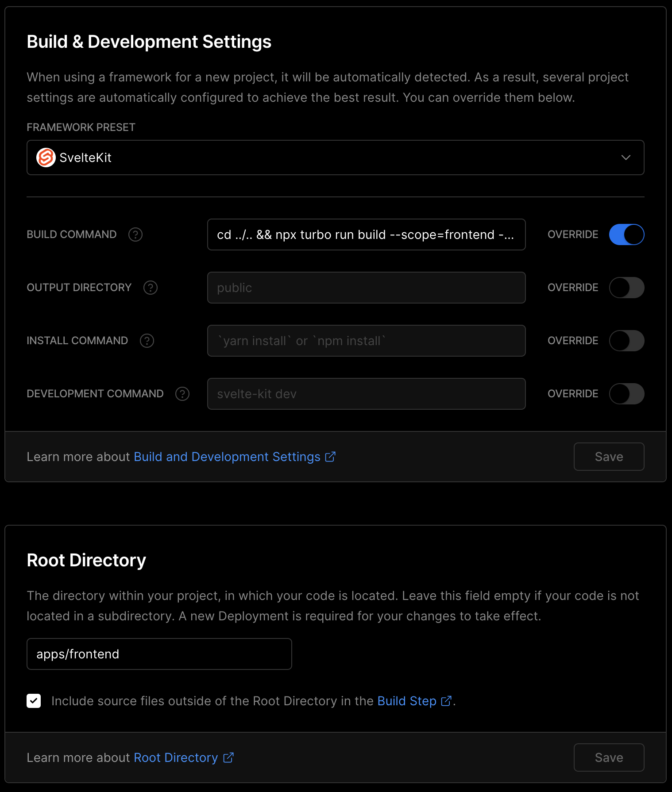

# devmark.it monorepo

Welcome to the https://devmark.it monorepo.

## Tech stack:
- Frontend: [svelte-kit](https://kit.svelte.dev/)
- Backend: [NestJS](https://nestjs.com/)
- Monorepo: [turborepo](https://turborepo.org/)

## Install
```bash
yarn
```

## Start
```bash
yarn dev
```
Open https://localhost:3000

## Deploy
### Frontend
The frontend package is compatible with [Vercel](https://vercel.com/). Your config should look like this:


Please remember to add the following Environment variable on Vercel: `VITE_WS_URL` with your backend url.

### Backend
The backend is 100% compatible with heroku. The Procfile will trigger the production build and run the app. Please remember to set your `FRONTEND_URL` env variable with your frontend url (CORS).

## :hammer_and_wrench: Support

Please [open an issue](https://github.com/Fedeorlandau/devmark.it/issues/new) for support.

## :memo: Contributing

Please contribute using [Github Flow](https://guides.github.com/introduction/flow/). Create a branch, add commits, and [open a pull request](https://github.com/Fedeorlandau/devmark.it/compare/).

## :scroll: License

[](https://opensource.org/licenses/MIT)